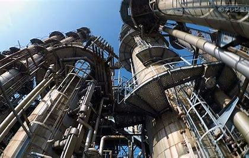
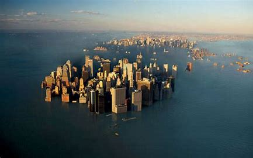

<html>

<head>

</head>

<body lang=JA style='word-wrap:break-word;text-justify-trim:punctuation'>

～環境STATION～

環境問題について。

目次

<ul>
 <li>始めに</li>

 <li>工場</li>

 <li>海面上昇</li>

 <li>フロンガス</uli>

</ul>

<h2>始めに</h2>

環境問題は目に見えない形でも身近に存在している。しかし、内閣府の調査では環境問題に対しての関心は高まりつつはあるが未だに興味・関心を持たない人が40%程度いる。その中でも一番目に見えて、自分の肌で感じることができる地球温暖化について焦点を当てていきたいと思う。

<a href="https://kaitoikeuchi.github.io/Kankyou.com/プロスタ.htm">工場</a>

<a href="https://kaitoikeuchi.github.io/Kankyou.com/工場による地球温暖化の影響.html">海面上昇</a>

　<a href="https://kaitoikeuchi.github.io/Kankyou.com/フロンによるオゾン層の破壊２.htm">フロンガス</a>

　　　　　　　　　　　　　　　　　　　　　　　　　　　　　　　　　　　　　　　　　　　　　　　

&nbsp;

&nbsp;

概要

メンバー(佐々木、丸山、勝股、稗田、曽根、池内)

&nbsp;

